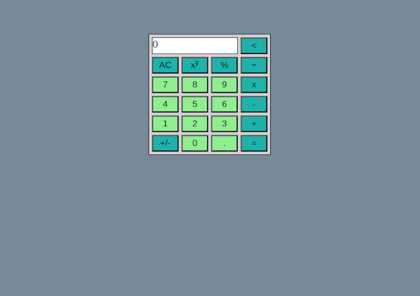

# Calculator

## Project info

A fully functional calculator with basic arithmetic operations that can be controlled with mouse or keyboard. This is the capstone project of [The Odin Project's Foundations course](https://www.theodinproject.com/paths/foundations/courses/foundations).

Project description can be found [here](https://www.theodinproject.com/lessons/foundations-calculator).

## Live demo

Live demo available [here](https://jcampbell57.github.io/odin-calculator/)

## Table of Contents

* [Technologies utilized](#technologies-utilized)
* [Learning outcomes](#learning-outcomes)
* [Project screenshot](#project-screenshot)
* [Behind the Scenes](#behind-the-scenes)
* [Installation](#installation)

## Technologies utilized

- HTML5
- CSS3
- JavaScript ES6

## Learning outcomes

This project helped to reinforce the following skills:

- JavaScript functions
- JavaScript event listeners
- DOM manipulation
- Flexbox
- implementing keyboard support

## Project screenshot

## Behind the scenes

### Improvements

This project could be improved with:

- history of past operations stored on the side, perhaps in a collapsable container
- Live preview of n1, operation, n2, and calculated value within input window. 
    - on the bottom right, greyed out, with regular display top left, black

## Installation

- Clone this repository to your desktop.
- Navigate to the top level of the directory by running `cd odin-calculator`.
- Open `index.html` in your browser.
